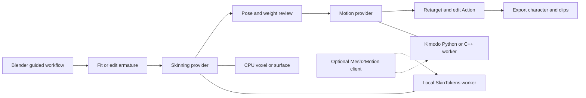

# Local rigging, skinning and AI motion: Mesh2Motion versus Blender

Research date: 3 October 2026. Target: a consumer NVIDIA GPU with 16–24 GB VRAM, as specified by the user. Repository inspected: `Mesh2Motion/mesh2motion-app`, branch `main`, commit `79f3f61`.

**Updated recommendation: build a standalone Blender extension that replaces ARP and Voxel Heat Diffusion.** Create a compact game deform skeleton directly, use local AI as the primary organic skinning proposal, and refine difficult regions with open surface/volume methods or exact rigid attachment. Use UniRig or another general generator as a separate creature option and add Kimodo motion with explicit retargeting. Keep the worker protocol reusable by Mesh2Motion.

The user's replacement requirement supersedes the earlier installed-tool integration proposal. ARP and the installed VHD package are reference baselines only. The detailed current design is in [Adaptive local skinning and standalone extension design](./adaptive-local-skinning-design.md). Puppeteer's released skinning dependency chain also fails the production shortlist because PartField is research-only, as corrected below.

The subsequent scene inspection and Unity-first implementation decisions are in [Final Unity humanoid extension plan](./unity-humanoid-extension-final-plan.md).

The final plan has been expanded with 14 local avatar candidates from the user's ReadyPlayerMe, BANTER and Altspace directories, read-only metadata and six successful isolated Blender imports/opens. It adds family-separated evaluation, seam-aware refinement, modular/LOD selection, source-scale handling and morph preservation. These preparation checks do not demonstrate AI quality. The [compact build handoff](./build-handoff.md) preserves the implementation starting state and remaining gates.

This is a source and architecture investigation with isolated smoke tests of the installed CPU skinning tools. No AI checkpoints were installed and no AI inference benchmarks were run. No application behavior, installed add-on files or currently open Blender scene was changed. Hardware figures below are attributed upstream requirements or measurements; the proposed integration and acceptance criteria are engineering recommendations.

## What the project already does

The local project is a TypeScript, Vite and three.js application. There is no Python inference service in `package.json`. It already has skeleton editing, geometric skinning, animation preview, animation retargeting, and GLB and FBX export. The README understates the current import and export support: implementation files are the better reference for integration work.

| Area | Code inspected | Consequence for integration |
| --- | --- | --- |
| Mesh preparation | `src/lib/processes/load-model/StepLoadModel.ts`, `ModelCleanupUtility.ts` | The creation path bakes object transforms into geometry and may scale extreme inputs. Send the resulting mesh and edited skeleton in the same coordinate space. |
| Skeleton selection | `src/lib/RigConfig.ts`, `src/lib/processes/load-skeleton/StepLoadSkeleton.ts` | Skeleton types select both templates and animation libraries. A novel hierarchy does not acquire compatible animations by selecting a category. |
| Skeleton editing | `src/lib/processes/edit-skeleton/StepEditSkeleton.ts` | Keep this correction stage after AI placement. Every skeleton edit must invalidate weights calculated for the previous pose. |
| Current weighting | `src/lib/solvers/SkinningAlgorithm.ts`, `WeightCalculator.ts` | Weights come from geometric calculations, extremity correction, optional arm correction, smoothing, normalization and optional head correction. They are not learned predictions. |
| Binding and attributes | `src/lib/processes/weight-skin/StepWeightSkin.ts` | Each geometry receives four `skinIndex` and four `skinWeight` values per vertex. Bone indices must match the binding skeleton's order. |
| Orchestration | `src/Mesh2MotionEngine.ts`, especially `calculate_skin_weighting_for_models()` | Skinning currently runs synchronously and recreates the geometric solver. A local AI job needs asynchronous orchestration and a provider abstraction. |
| Retargeting | `src/retarget/AnimationRetargetService.ts`, `bone-automap/`, `human-retargeting/` | Existing infrastructure is useful for generated rigs, but arbitrary animal hierarchies and unnamed joints need further mapping work. |
| Export | `src/lib/processes/export-to-file/StepExportToFile.ts` and export services | Preserve the current material, hierarchy, bone naming and animation cleanup workflow. A separate rest-pose export for inference is needed: this export method rejects an empty animation selection. |

I also decoded the JSON headers of the nine template GLBs. Their stored skin joint counts are: human 66, fox 49, bird 55, dragon 99, kaiju 58, spider 56, snake 28, fish/shark 33 and horse 56. These counts precede optional hand modifications. The human rig starts with `root`, `pelvis`, `spine_01`, `spine_02`; this is not simply a standard Mixamo skeleton.

`Utility.bone_list_from_hierarchy()` collects bones by traversal, and `Generators.create_skeleton()` uses that list. Imported AI indices cannot be assumed to have the same ordering. Leaf and tip bones also have special meaning in the editor. They need explicit handling when translating between model tokens, Blender bones and the original three.js skeleton.

The retarget service already captures the target's rest transforms rather than depending on `Skeleton.pose()`. Preserve this approach when previewing AI results, especially for rigs with transformed armature parents.

## Available options

The shortlist distinguishes an executable release from a paper demonstrating a method. A published VRAM number for one stage is not a guarantee for the entire pipeline or for every mesh.

| Option | Released capability | Consumer hardware evidence | License evidence | Proposed role |
| --- | --- | --- | --- | --- |
| [SkinTokens and TokenRig](https://github.com/VAST-AI-Research/SkinTokens) | Generates hierarchy and weights; supports an existing skeleton | Authors specify NVIDIA GPU with at least 14 GB VRAM | MIT code; MIT-labelled weights | First evaluation on 16–24 GB |
| [Puppeteer](https://github.com/Seed3D/Puppeteer) | Separate skeleton and skinning stages, released checkpoints | Authors report 4.6 GB skeleton inference and 4.2 GB skinning inference | Apache wrapper/model card; required PartField code is noncommercial research-only | Exclude released skinning chain from production default |
| [UniRig](https://github.com/VAST-AI-Research/UniRig) | Separate skeleton prediction, skinning and merge stages | Repository specifies at least 8 GB CUDA VRAM for generation | MIT code and model card | Alternative for diverse creature rigs |
| [Make It Animatable](https://github.com/jasongzy/Make-It-Animatable) | Humanoid rigging, weights and pose prediction; v2 available | No inference minimum verified in the inspected official documentation | MIT wrapper; Apache 2.0 model-card label; v2 backbone has additional terms | Humanoid fitting comparator, with v2 licensing gate |
| [RigAnything](https://github.com/Isabella98Liu/RigAnything) | End-to-end GLB or OBJ input to rigged GLB | CUDA inference; no explicit minimum verified | Adobe Research License, noncommercial research only | Research comparison; exclude from product shortlist |
| [RigNet](https://github.com/zhan-xu/RigNet) | Joint, connectivity and weight prediction, pretrained models | CUDA implementation and documented historical Windows support | GPL v3 | Legacy baseline |
| [skin-tokens.cpp](https://github.com/localai-org/skin-tokens.cpp) | SkinTokens port with CPU and Vulkan execution | CPU/Vulkan paths documented; no consumer memory or latency guarantee verified | Apache 2.0 port; upstream weights have separate terms | Experimental portability option |
| [Blender automatic weights](https://docs.blender.org/manual/nl/5.0/animation/armatures/skinning/parenting.html) | Geometric weighting of an existing armature | Does not require an ML inference GPU | Blender and scripting terms apply | Local non-AI quality baseline |

License labels above describe the inspected artifacts, not a complete dependency or redistribution audit. This distinction matters for MIA v2's Hunyuan backbone, Puppeteer's external encoders and converted model bundles.

### SkinTokens and TokenRig

This is the most attractive first experiment for the requested hardware. The official release has two required checkpoints, approximately 1.6 GB combined; checkpoint storage size is not inference memory. Its model card labels them MIT and confirms the 14 GB NVIDIA requirement. [Official model card](https://huggingface.co/VAST-AI/SkinTokens).

The CLI supports `--use_skeleton` for weight generation on an existing rig and `--use_transfer` for original texture and scale transfer. The documented environment uses Python 3.11 or later, CUDA, PyTorch and FlashAttention. Default beam count is ten. [Official instructions](https://github.com/VAST-AI-Research/SkinTokens).

Source inspection confirms that the demo retains skeleton tokens when requested and exports four influences per vertex. It starts a separate Blender process and uses CUDA for tensor batches. Thus, integrating it means managing a worker lifecycle as well as running the neural network. [Demo implementation](https://github.com/VAST-AI-Research/SkinTokens/blob/main/demo.py).

**Integration inference:** existing-skeleton mode is a good fit for Mesh2Motion, but it does not prove that the 66-joint human or 99-joint dragon template will round-trip unchanged. Check names, hierarchy, local axes, joint placement, leaf bones and bind transforms before accepting results. Quantized joint tokens and Blender conversion make exact preservation an acceptance test, not an assumption.

### Puppeteer

Its skinning stage explicitly accepts a supplied mesh and skeleton, consumes OBJ geometry plus a RigNet-format text hierarchy and can save weights as NPY. The skinning README reports 4.2 GB for its evaluation inference; the skeleton README reports 4.6 GB and 1–2 seconds for skeleton inference. These are separate stage figures, not complete rigging latency. Its required dependency now excludes the released skinning chain from our production default. [Skinning documentation](https://github.com/Seed3D/Puppeteer/tree/main/skinning), [skeleton documentation](https://github.com/Seed3D/Puppeteer/tree/main/skeleton).

Its environment is older and more involved: Python 3.10, PyTorch 2.1.1, CUDA 11.8, FlashAttention, torch-scatter and PyTorch3D. Keep it isolated from SkinTokens. Rig export through Blender is provided. [Repository instructions](https://github.com/Seed3D/Puppeteer).

The official model repository contains skeleton and skinning checkpoint directories and labels the models Apache 2.0. Additional encoder weights are required by the stage documentation. [Released files](https://huggingface.co/Seed3D/Puppeteer/tree/main), [model card](https://huggingface.co/Seed3D/Puppeteer).

**Dependency correction:** the skinning instructions require PartField checkpoints and its implementation. PartField section 3.3 limits the code to noncommercial research and educational use, except for NVIDIA and affiliates. The Apache wrapper does not remove that limitation. Replacing the encoder would require separate compatibility/training work. [Required encoder](https://github.com/Seed3D/Puppeteer/blob/main/skinning/README.md), [PartField license](https://github.com/nv-tlabs/PartField/blob/main/LICENSE).

**Integration inference:** an OBJ and text adapter can avoid replacing Mesh2Motion's geometry or materials. Preserve original vertex order through OBJ conversion and identify how weight columns correspond to joints, including terminal bones. Run skeleton and skinning sequentially if using both. Leave the separate video-guided animation system outside the initial integration.

### UniRig

UniRig offers explicit skeleton, skinning and merge scripts, and its instructions encourage correcting the skeleton before skinning. Its repository specifies an 8 GB CUDA generation minimum. Installation includes sparse-convolution and PyTorch geometric extensions, and potentially difficult FlashAttention builds. [Official repository](https://github.com/VAST-AI-Research/UniRig).

**Release status correction:** the official file tree now includes `skin/articulation-xl/model.ckpt`, listed at 4.38 GB. Older descriptions stating that all skinning weights are unreleased are stale. The repository still distinguishes available Articulation-XL checkpoints from planned checkpoints trained on Rig-XL/VRoid that reproduce the paper's main results. [Actual skin checkpoint](https://huggingface.co/VAST-AI/UniRig/tree/main/skin/articulation-xl).

**Integration inference:** useful for AI skeleton exploration across Mesh2Motion's animal categories, with more packaging complexity than a pure weight-returning adapter. Benchmark the released checkpoint specifically; do not assume every result in the paper is reproducible with that release.

### Make It Animatable

MIA focuses on humanoids and its published workflow produces weights, joint placement and pose-to-rest transformations. That pose capability is useful for inputs whose arms are lowered or asymmetrical. [Author project page](https://jasongzy.github.io/Make-It-Animatable/).

The v2 branch upgrades to a Hunyuan3D 2.1 ShapeVAE backbone and supplies revised models and Blender integration. The documented training configuration uses an A100 80 GB; that is not an inference requirement. The inspected instructions do not establish a consumer inference VRAM minimum. [Official v2 instructions](https://github.com/jasongzy/Make-It-Animatable/tree/v2).

The v2 demo imports a Mixamo joint vocabulary and kinematic tree, and chunks dense vertex queries. It is therefore a humanoid template pipeline, rather than a universal replacement for every Mesh2Motion skeleton. [v2 implementation](https://github.com/jasongzy/Make-It-Animatable/blob/v2/app_v2.py).

The code is [MIT](https://github.com/jasongzy/Make-It-Animatable/blob/v2/LICENSE), while the [MIA model card](https://huggingface.co/jasongzy/Make-It-Animatable) labels weights Apache 2.0. The Hunyuan3D 2.1 backbone has a separate community license whose territory excludes the EU, UK and South Korea. Determine its applicability to the specific v2 package before selecting v2 for use or distribution in those regions; the wrapper and model-card labels alone do not resolve it. [Backbone license](https://huggingface.co/tencent/Hunyuan3D-2.1/blob/main/LICENSE).

**Integration inference:** benchmark humanoid placement separately from weighting. Use semantic correspondences to fit the Mesh2Motion template, then skin that fitted template. A rename alone cannot reconcile different joint counts, rest poses and axes. Keep the original MIA version as a separate comparator while the v2 dependency terms are unresolved.

### RigAnything and RigNet

RigAnything has real inference code, a released checkpoint and rigged GLB export. The example simplifies to 8,192 faces, and the documentation identifies `cuda:0` as the inference device without specifying minimum VRAM. Simplification changes the mesh used for the returned rig. [Official instructions](https://github.com/Isabella98Liu/RigAnything).

Its [Adobe Research License](https://github.com/Isabella98Liu/RigAnything/blob/main/LICENSE.md) restricts use to noncommercial research, including restrictions on commercial product development. It should not be packaged as a normal Mesh2Motion provider under an assumption of permissive licensing.

RigNet remains a useful historic comparator. Its instructions target Python 3.7 and older CUDA/PyTorch dependencies, recommend 1,000–5,000 vertices, and declare GPL v3. [Official repository](https://github.com/zhan-xu/RigNet). **Engineering judgment:** dependency maintenance, proxy-mesh transfer and licensing make it a weaker first integration than the newer options.

### CPU and Vulkan through skin-tokens.cpp

The independent C++23/GGML port documents CPU and Vulkan execution, an F16 bundle, GLB input/output, a supplied-skeleton `skin` command and a C API. Its current README reports component and full-binding numerical parity fixtures, describes device-local KV cache management and explicit SOMA30-to-Mixamo52 retargeting, marks unconstrained topology generation experimental, and says atlas textures are not yet round-tripped. Native Windows packaging and consumer performance were not verified. Numerical parity fixtures do not establish real-character quality. [Port documentation](https://github.com/localai-org/skin-tokens.cpp).

**Engineering judgment:** compare it with official PyTorch inference early as a native worker candidate for the replacement extension. Returned weights applied to original Blender/browser geometry could avoid its texture-export limitation, but the correspondence and numerical adapter still need validation. Its retarget mapping is also a useful reference for Kimodo integration.

### Other approaches and scope limits

MagicArticulate's public release documents skeleton inference at 4.6 GB and 1–2 seconds; it points users to its later Puppeteer project. Treat the released MagicArticulate component as a skeleton baseline rather than assuming every skinning component described by the paper is packaged. [Official release](https://github.com/Seed3D/MagicArticulate).

ViP-Rig explores visual guidance for controllable skeleton generation and skinning. It is relevant to an eventual assisted editor, but I did not establish a released consumer-hardware package from the inspected paper and searches. [ViP-Rig paper](https://arxiv.org/abs/2607.27982). RigMo learns rigs and motion from deforming mesh sequences; that input/output workflow differs from binding an uploaded static mesh to the app's existing animation library. [RigMo paper](https://arxiv.org/abs/2601.06378).

Blender automatic weights and [bounded biharmonic weights](https://libigl.github.io/tutorial/#bounded-biharmonic-weights) are meaningful non-AI baselines. They help determine whether the complexity of learned inference produces enough deformation improvement. Blender's manual explicitly describes overlap and deformation failures that can still require manual correction. Hosted auto-rigging services and mesh-generation models are outside the local inference shortlist; generating geometry is a separate task from generating a compatible skeletal rig.

## What the published comparisons establish

The SkinTokens paper's Table 4 gives the following Articulation 2.0 results. These are **reported by the SkinTokens authors**, rather than independent reproduction or measurements of Mesh2Motion.

| Method | Skin L1 error, lower is better | Motion loss, lower is better |
| --- | --- | --- |
| RigNet | 0.0431 | 0.0915 |
| Puppeteer | 0.0278 | 0.0314 |
| UniRig | 0.0297 | 0.0419 |
| TokenRig with four skin tokens and GRPO | 0.0174 | 0.0214 |

Use the four-token row because the released recommended checkpoint is identified as four-token; do not quote the better six-token row as its measured performance. These figures support evaluating TokenRig, but do not establish performance on Mesh2Motion templates, textured production meshes or the user's GPU. Ground-truth weighting and generated-hierarchy experiments also need separate evaluation. [Paper and comparison tables](https://arxiv.org/html/2602.04805v1).

## Hardware and operating system assessment

| Hardware | Practical interpretation |
| --- | --- |
| NVIDIA 16 GB | Above SkinTokens' documented 14 GB minimum, with limited headroom. Evaluate batch one and lower beam count alongside defaults. High joint counts and other GPU applications can still exhaust memory. |
| NVIDIA 24 GB | Preferred evaluation tier by engineering judgment. More headroom for encoders, decoder queries and generation. This is not a promise that every dense mesh fits. |
| NVIDIA 8–12 GB | Below the documented official SkinTokens minimum. Evaluate UniRig or the native SkinTokens path with measured memory; Puppeteer's reported low stage memory does not overcome its dependency licensing limitation. |
| AMD GPU | No verified official ROCm route for the shortlisted PyTorch releases. Vulkan in the C++ port is a potential experimental route. |
| CPU only | Existing geometric solver and Blender weighting are practical baselines. The C++ port offers an AI execution path whose responsiveness still needs measurement. |
| Apple Silicon | No verified official Metal/MPS implementation for these ML pipelines was established. Avoid assuming that a generic PyTorch device change makes CUDA extensions work. |

The NVIDIA requirements come from the [SkinTokens instructions](https://github.com/VAST-AI-Research/SkinTokens), [UniRig instructions](https://github.com/VAST-AI-Research/UniRig), and Puppeteer's stage documentation linked above. Hardware headroom and provider choices are recommendations, not new benchmark claims.

For this Windows repository, I would use a Linux/WSL2 NVIDIA inference environment initially and retain the Windows browser/Vite frontend. FlashAttention's own instructions say Windows compilation still requires more testing. This supports a Linux-first packaging experiment; native Windows compatibility should be measured before promising an installer. [FlashAttention requirements](https://github.com/Dao-AILab/flash-attention#installation-and-features).

Start planning with 32 GB system RAM and SSD storage; 64 GB is useful for dense assets and multiple environments. These are proposed workstation allowances, not published model minima. Download only required checkpoints and external encoders, rather than training datasets. GPU architecture and extension compatibility matter as well as VRAM: old PyTorch wheels should not be assumed to support a newer GPU.

The scope is pretrained inference. Training from scratch has very different requirements: for example, UniRig documents a skin-training configuration using at least 60 GB on one GPU. That number must not be presented as its inference minimum. [UniRig training instructions](https://github.com/VAST-AI-Research/UniRig).

## Proposed integration

### Skinning the existing rig

The first feature should follow this flow: import mesh, select and edit a Mesh2Motion template, request local AI weights, validate and preview the result, then use the existing animation and export stages.

Add a `SkinningProvider` interface with the current geometric solver as one provider and a local worker as another. Its input should contain every mesh primitive plus the complete fitted skeleton, all in one documented coordinate system. Its output should contain weights and explicit bone identifiers for the original vertices.

Puppeteer can accept an explicit mesh and skeleton text representation. SkinTokens' released CLI uses a GLB with an existing armature. For a minimal experiment, create an inference-only GLB from cloned geometry and the fitted rig, with valid temporary weights so the importer actually retains a skin. The original geometric weights could supply that temporary binding. Verify that the worker conditions on the skeleton and replaces the temporary weights; do not interpret the temporary weights as its prediction.

For production, prefer an adapter that retrieves model results before lossy export, maps them onto original mesh vertices, and returns compact weight buffers. Keep the user's materials, UVs and geometry in the browser. Imported GLB output is useful for an early round-trip experiment but should not silently replace the original asset.

### Generating a new rig

AI skeleton generation needs a second flow: infer a hierarchy, inspect and edit it, skin that final hierarchy, map it to a source animation rig, retarget clips, preview, then export.

A generated skeleton can differ in root placement, bone count, axes, names and chain structure. Matching names does not make animation rotations compatible. Reuse the retargeting services and canonical mapping vocabulary, with explicit user mapping where confidence is insufficient. Human chain logic does not establish support for arbitrary wings, tentacles or eight-legged rigs.

For a simpler automatic-placement feature, use AI joint proposals to fit the existing template while preserving its semantic joint structure. The fitting stage must solve correspondences, missing joints and pose differences; none of the shortlisted generic generators should be assumed to supply Mesh2Motion's exact hierarchy automatically.

### Local worker and jobs

Keep model inference outside the browser. The inspected releases use CUDA, Python, Blender and native extensions, so a browser-native ONNX/WebGPU deployment would be a separate porting project.

Proposed API:

| Endpoint | Purpose |
| --- | --- |
| `GET /v1/capabilities` | Report provider versions, loaded checkpoints, device, supported operations and mesh limits |
| `POST /v1/jobs` | Submit a mesh and optional fitted skeleton for `skin` or `rig` |
| `GET /v1/jobs/{id}` | Return status, stage, progress when available and structured failure information |
| `DELETE /v1/jobs/{id}` | Cancel the job and release resources |
| `GET /v1/jobs/{id}/result` | Return validated weights or a generated rig result |

Start with one GPU job at a time. Cache by geometry content, topology, fitted skeleton/rest transforms, provider/checkpoint revision and generation settings. An edit or a new upload increments the model revision; results for older revisions must be discarded. Providers should own their own environments so conflicting CUDA extensions do not share a dependency set.

The upstream SkinTokens Blender server binds to `0.0.0.0` and deserializes torch objects. Its internal protocol should remain private to the inference environment. The browser-facing adapter should use a versioned JSON/binary protocol and restrict local origins; a Vite development proxy is one option. Shipping a public HTTPS frontend talking to localhost adds browser access-policy requirements that need a separate deployment check. [Server source](https://github.com/VAST-AI-Research/SkinTokens/blob/main/src/server/bpy_server.py), [serialization source](https://github.com/VAST-AI-Research/SkinTokens/blob/main/src/server/spec.py).

### Geometry and rig contracts

These are implementation requirements inferred from the current app and the upstream conversion paths:

1. Assign stable IDs to mesh primitives and to every bone. Preserve the relationship between frontend bone order, model bone order and returned weight columns.
2. Send geometry after the same cleanup and user transforms used by the editor. Record normalization and its inverse explicitly. Apply it to geometry and joints consistently.
3. Account for exporter/importer vertex splitting, welding and primitive reordering. Equal vertex counts alone do not prove correspondence. Preserve explicit maps or verify topology and transfer weights back to original vertices.
4. If a proxy is simplified, transfer weights using surface correspondence with component restrictions. Spatial nearest neighbours alone can mix the arm and torso or adjacent legs. Prefer barycentric interpolation on the matched proxy surface where applicable.
5. Select the greatest four valid influences per original vertex, remap indices to the binding skeleton, and normalize. Reject nonfinite values, invalid indices and unsupported results. Report zero-weight vertices rather than silently hiding a failed model result.
6. In skin-only mode, retain the original hierarchy, axes and bind transforms. If backend conversion moves joints beyond an agreed tolerance, reject the result or extract only the weights with a verified remapping.
7. Preserve original materials, UV seams, vertex colours and mesh boundaries. Test separate eyes, teeth, clothing and rigid accessories independently.
8. Keep learned weighting independent of existing heuristic corrections initially. Benchmark postprocessing as a separate setting; automatically applying arm/head corrections could obscure model performance or damage valid predictions.

### User workflow

Add an optional local AI skinning action near the skeleton test/weight preview controls. Show whether the local engine is ready, which operation is running, and actionable failures such as out-of-memory or invalid topology. Preserve manual edits and offer a geometric result if AI fails. Preview the two results on identical clips before accepting a replacement.

Skeleton generation should remain visibly distinct from improving weights. It changes the rig the user must edit and the mapping needed for animations.

## Evaluation plan before implementation commitment

Run a common corpus on the actual 16 GB or 24 GB GPU. Record the exact device, driver, runtime versions, model commit/checkpoint hash and settings. Published numbers are not substitutes for these runs.

Start with the nine bundled model categories, then add independent licensed examples: an A-pose human, a character with touching limbs, thin fingers, disconnected clothing, separate facial parts, a dense AI-generated mesh and a mesh with holes. Bundled assets establish app compatibility; they do not establish generalization.

| Experiment | Inputs held constant | Question answered |
| --- | --- | --- |
| Existing solver versus Blender versus SkinTokens versus license-compatible UniRig/native alternatives | Same original mesh and edited Mesh2Motion skeleton | Does AI improve skinning independently of joint placement? |
| Postprocessing comparison | Same model result and skeleton | Does smoothing or voxel filtering help, and where does it hurt? |
| Skeleton generation comparison | Same mesh, multiple fixed seeds | Which method gives a usable hierarchy and how much editing remains? |
| Resolution comparison | Same asset at several proxy densities | How much memory and quality does simplification trade away? |
| Animation round trip | Same accepted rig and clips | Are axes, bind pose, root motion, textures and weights preserved through export/reload? |

Record cold and warm elapsed times separately, including preprocessing, model load, inference, weight transfer and export. Measure peak allocated/reserved GPU memory and process/device memory, host RAM, failure rates and manual correction time. Browser interactivity and cancellation are also part of usability.

Inspect elbows, shoulders, hips, knees, finger bends, wings, tails and root motion in animated previews. Where licensed ground-truth rigs exist, compare influence support and deformed vertex positions, not only dense weight MAE. For generic imported assets, use visual ratings and measured correction effort; there is no ground truth to invent.

Suggested acceptance gates are proposals:

- Weight buffers have exactly four entries per original vertex, finite nonnegative values, valid remapped bone indices and sums within `1e-4` of one.
- Skin-only results preserve the original skeleton and materials and produce no unexpected bind-pose displacement.
- Export and reload preserve animation targets, rest pose and the chosen result across multi-mesh assets.
- Repeatable deformation improvements occur on the target corpus without unacceptable failures or correction effort.
- The chosen workload fits the target GPU with measured headroom and meets an agreed interactive latency budget.
- Cancellation and a stale result never replace a newer edited model; provider failure leaves the geometric workflow usable.

## Mesh2Motion integration sequence, if the browser remains the primary interface

1. **Benchmark adapter:** export fitted template inputs, run SkinTokens skin-only and a license-compatible comparator externally, and compare animated results. Establish bone and vertex correspondence before any UI work. Puppeteer's released skinning dependency chain is excluded from the production shortlist.
2. **Provider architecture:** introduce asynchronous jobs and a common validated result format. Keep the current geometric path as the default until quality evidence supports a change.
3. **Local AI skinning UI:** connect the winning provider, revision-aware cancellation/cache, preview comparison and export round-trip checks.
4. **Automatic placement:** evaluate original MIA for humans and SkinTokens/UniRig joint proposals for creatures, fitting the existing templates where practical and checking their complete model dependencies.
5. **Generated hierarchy workflow:** extend semantic mapping and retargeting, then add full rig generation as an explicitly supported mode.
6. **Portable backend:** consider the C++/Vulkan port after reference accuracy, texture handling and native packaging have been validated.

The key decision for this browser integration is whether to retain Mesh2Motion's templates and animation library or accept generated hierarchies and invest in broader retargeting. Retaining templates for the first integration has the clearest path to a useful, testable feature. The user's subsequent Blender and Kimodo requirements favor the extension route described next.

## Blender extension assessment

For a local character creation and animation workflow, **Blender is the better primary interface**. This is an engineering judgment based on the inspected project and installed add-on: most correction and authoring tools already exist in Blender. A focused extension can guide users through fitting, skinning, generation, review and export instead of implementing another weight editor, rig editor and animation authoring system.

| Decision | Blender extension | Mesh2Motion integration |
| --- | --- | --- |
| Mesh and skeleton correction | Existing mesh editing, armature editing, vertex groups and weight painting | Guided joint editing exists; deeper mesh/weight tools require development |
| Deformation inspection | Native pose tools, modifiers and animation editing | Convenient existing animation-library preview |
| Local solver access | Open geometric workers can be owned by the extension | Requires a local bridge and mesh/skeleton serialization |
| AI motion authoring | Actions, timeline, NLA and constraints provide the host workflow | Generated clips can preview through three.js; editing and constraint UI require development |
| Accessibility | Requires Blender and a guided panel to reduce its complexity | Easier browser onboarding and distribution |
| Existing creature workflow | Templates and animation assets would need import, adaptation and licensing review | Nine template families and associated animations already integrated |

A Blender extension does not remove the difficult inference, retargeting or packaging work. It reduces the amount of authoring infrastructure needed around it. Retain a common worker/job format so the browser can become another client later; do not port the TypeScript application wholesale into Python.

### Installed voxel_skinning: source inspection

Inspected the user-specified folder: `C:\Users\Elin\AppData\Roaming\Blender Foundation\Blender\5.2\scripts\addons\voxel_skinning`. Its Python package declares version **3.5.0**. Bundled Windows x64 voxel and surface executables identify themselves as **3.3.3**. Cached Python files were not treated as evidence of functionality.

This is **geometric CPU heat diffusion**, rather than learned AI. It requires a placed armature and calculates vertex weights for its deform bones. The package includes voxel and surface solvers, weight import/export, a joint alignment helper and a Corrective Smooth Baker. The vendor describes voxel volume diffusion and a surface alternative useful for finer extremities. These are complementary candidates to benchmark, not a guarantee of good weights on every character. [Vendor explanation](https://www.mesh-online.net/voxel.html).

Findings from the installed source:

- `wm.voxel_heat_diffuse` and `wm.surface_heat_diffuse` launch native processes and poll them through a Blender modal timer. A reader thread handles process output; weight application occurs in the Blender operator.
- Bone heads and tails and mesh vertices are exported in world coordinates. Only deform bones are included, with an option to restrict to selected bones.
- Selected meshes are sorted by name and serialized with cumulative vertex offsets. Imported weights map those indices back to each original mesh. The solver need not replace geometry, UVs or materials.
- Export uses raw `obj.data` geometry, not evaluated modifier output. A future adapter needs an explicit policy for subdivision, mirror, solidify and other topology-changing modifiers.
- Defaults are resolution 128, five diffusion loops, 64 sample rays, eight influences and falloff 0.2. For the current Mesh2Motion buffer format or a four-influence game export, request four or prune and renormalize before export. Keep richer Blender weights when useful.
- Protected selected vertices retain their previous weights; unrelated vertex groups remain. This supports a workflow that recomputes difficult regions while preserving manually corrected ones.
- The alignment helper assists joint positioning. The Corrective Smooth Baker fits weights against corrected deformations with numerical optimization and sampled poses; neither is a neural skeleton placement model.

The current wrapper writes fixed mesh, bone, weight and voxel-cache files under its own `data` directory. The modal completion branch imports a weight file when the subprocess exits without first requiring a successful exit code. Shared files and an old weight file therefore create collision/stale-result risks. The source also lacks a scene-revision check before applying results. These are source-level integration risks; I did not induce failures in the user's scene.

For a robust replacement provider, use a unique writable job directory, validate return code and fresh complete output, capture vertex and bone correspondence, reject results after topology/rest-pose edits, and apply accepted weights as one undoable operation. Preserve selection, active object and parent relationships deliberately. The installed operator's shared storage behavior is reference evidence for what our independent worker should improve.

### Local verification and its limits

Tests ran in separate factory-startup, background Blender processes and temporary directories outside the installed add-on:

| Check | Result | What it establishes |
| --- | --- | --- |
| Full package register/unregister | Passed on Blender 5.2.0 LTS, embedded Python 3.13.13 | Basic API compatibility and both operators registered |
| Windows x64 voxel executable | Exit 0; 24 weight records for 12 vertices and two bones | Native execution and usable output format |
| Windows x64 surface executable | Exit 0; 24 weight records for the same input | Native execution and usable output format |
| Multi-mesh weight import | Passed on two six-vertex meshes | Cumulative vertex correspondence worked |
| Protected selected weights | Passed, preserving test weights 0.25/0.75 | Region protection worked in this isolated import |
| Unrelated vertex group | Passed | Existing unrelated test group survived import |

The solver input was a closed 12-vertex prism with two central bone segments, resolution 32, one diffusion loop and 32 rays. Weight sums were within `1e-6` of one and lower/upper ends favored their corresponding bones. Approximate process times were 0.061 seconds for voxel and 0.013 seconds for surface. These tiny-mesh timings are smoke-test observations, **not character benchmarks**. Interactive modal execution, complex character deformation, high-resolution memory behavior and corrective baking remain untested.

The Python files contain GPL notices and the package includes GPL text. The voxel executable separately reports all rights reserved; the surface executable reports MIT. Do not assume the Python license grants permission to redistribute the voxel binary. The replacement must use open implementations. The author's [MIT surface implementation](https://github.com/meshonline/Surface-Heat-Diffuse-Skinning) is a benchmarkable source option: it diffuses over triangle-neighbor vertices but also uses a voxel grid for visibility/seeding, so it is not a grid-free algorithm.

### A local Mixamo-style workflow and actual Mixamo

There are two useful interpretations of the user's suggestion:

1. **Local marker-based authoring:** a guided panel places body landmarks, fits a chosen humanoid template, lets the user correct joints, then runs voxel/surface or AI skinning. This recreates the useful interaction pattern; it does not imply access to Mixamo's proprietary algorithm. Marker fitting itself can be geometric, with learned proposals added later.
2. **Optional Mixamo handoff:** export the character, let the user upload/rig it on Mixamo, then import the downloaded result and keep its skeleton or retarget its animations. Adobe documents marker-based auto-rigging and automatic mapping of already rigged FBX skeletons to animations. That mapping is distinct from recomputing skin weights for an arbitrary supplied skeleton. I found no documented supported public skin-only API in the inspected Adobe documentation. Treat this as a manual export/import option. [Adobe workflow](https://helpx.adobe.com/creative-cloud/help/mixamo-rigging-animation.html).

Actual Mixamo is an online service, free with an eligible Adobe ID; its auto-rigger targets bipedal humanoids, with restrictions on extra appendages and unsuitable geometry/poses. It therefore complements a humanoid workflow but cannot provide the local or general creature backend requested here. [Adobe FAQ](https://helpx.adobe.com/creative-cloud/faq/mixamo-faq.html).

## Kimodo and kimodo.cpp as motion providers

**Kimodo is a strong addition after rigging and skinning.** It generates motion on supported human/robot skeletons, so integration needs a source rig and retargeting onto the character's deform rig. Skinning quality and motion generation should be selectable independently.

The official implementation provides text generation with pose, end-effector, path and waypoint constraints. NVIDIA reports roughly 17 GB VRAM for fully GPU-resident generation, or less than 3 GB with `TEXT_ENCODER_DEVICE=cpu`; these are upstream figures. With 16 GB, use that CPU-text path as a reference configuration. A 24 GB card is a candidate for the full GPU path, subject to Blender's own usage. [Official implementation](https://github.com/nv-tlabs/kimodo).

Start with **Kimodo-SOMA-RP-v1.1** for character animation. Its card identifies a commercially usable NVIDIA Open Model License, 30-joint predicted body motion at 30 fps and a ten-second maximum per prompt. Code, motion checkpoints, body assets and text-encoder artifacts have distinct terms. The SMPL-X variant has different R&D restrictions and should not be the default product checkpoint. [SOMA model card](https://huggingface.co/nvidia/Kimodo-SOMA-RP-v1.1), [official model/license table](https://github.com/nv-tlabs/kimodo).

### Native port: what is available

The user-mentioned project is [kimodo.cpp](https://github.com/localai-org/kimodo.cpp), a C++/GGML port. It provides CPU/Vulkan inference, local rotations/root translations, a C API, multi-prompt transitions and skeleton-only animated GLB export. It returns compact SOMA30, whereas the official Python API expands to SOMA77. General pose/path constraint input, SOMA77 expansion, skinned-mesh export and motion-denoiser quantization are currently listed as unimplemented. These gaps favor a provider interface that can also call Python when constraints matter.

| Configuration | Evidence | Evaluation role |
| --- | --- | --- |
| Official Python, GPU text encoder | Upstream approximately 17 GB VRAM | Reference feature set on 24 GB |
| Official Python, CPU text encoder | Upstream less than 3 GB VRAM | Reference option on 16 GB; profile CPU delay |
| C++ Vulkan with Q8 text | Upstream RTX 5070 Ti 16 GiB measurements | First native packaging/throughput candidate |
| C++ CPU | Implemented; no local timing measured here | Compatibility fallback, not a promised interactive mode |
| C++ lower-bit text | Released alternatives, quality needs comparison | Memory optimization after Q8 reference |

The port's profiling document reports **8,894 MiB VRAM** for its resident native worker on an RTX 5070 Ti, and **4.55 seconds for a 150-frame, 100-step motion sample**. The reported warm isolated Q8 text encode is about 60 ms; cold upload adds about 1.1–1.2 seconds. These are project-maintainer measurements, not a reproduction or guarantee for all prompts. They are nevertheless concrete consumer-hardware evidence. [Profiling and workload details](https://github.com/localai-org/kimodo.cpp/blob/main/docs/PROFILING.md).

The released text encoder files are BF16 15.18 GB, Q8 8.14 GB, Q6 6.32 GB, Q5 5.33 GB, Q4 4.39 GB and mixed Q4_K_M 5.06 GB. The recommended Q8 plus the 1.13 GB SOMA motion file is approximately 9.27 GB of weight downloads; this is disk size, not total running memory. The encoder inherits Meta Llama 3 terms and uses LLM2Vec adapters. Lower-bit configurations are experiments rather than guaranteed equivalent motion quality. [Text bundle sizes and provenance](https://huggingface.co/LocalAI-io/Llama-3-Kimodo-GGML), [motion bundle](https://huggingface.co/LocalAI-io/Kimodo-SOMA-RP-v1.1-GGML), [comparison workflow](https://github.com/localai-org/kimodo.cpp/blob/main/docs/QUANTIZATION.md).

Upstream documents a Linux build. A [separate Windows fork](https://github.com/TheLocalLab/kimodo.cpp-windows) provides MSVC/CMake instructions, Windows launchers and GLB export. Its older BF16 bundle/disk description differs from the newer upstream Q8 bundle. Treat it as a packaging reference to inspect and test, not proof that the exact current upstream builds on this machine. No Kimodo build, download or inference was performed in this investigation.

### Existing Blender integration: evaluate before rebuilding

[Animatica Blender Plugin](https://github.com/animatica-ai/animatica-blender-plugin), formerly Proscenium, already supplies Blender 5+ motion generation, key poses, paths, pins and accept/reject previews. It is GPL-3.0-or-later, defaults to a hosted service and offers a self-hosted server setting. It is a useful existing client to evaluate or study; a new extension could focus on rigging/skinning and interoperate with it. Neither this plugin nor its server was installed here.

Its [Apache-2.0 reference server](https://github.com/animatica-ai/motionmcp-kimodo) wraps the Python model using MMCP, exposing capabilities and generation responses. **It does not currently provide arbitrary-rig retargeting**: `backbone.py` declares `supports_retargeting=False`, and the client's `request_builder.py` requires canonical joints for such servers. The hosted product's retargeting claims must not be attributed to this public local server. Its docs also contain older Proscenium/Blender setup names, so test current client-server interoperability rather than assuming compatibility. [Server source](https://github.com/animatica-ai/motionmcp-kimodo/blob/main/src/motionmcp_kimodo/backbone.py), [client source](https://github.com/animatica-ai/animatica-blender-plugin/blob/main/animatica_blender/request_builder.py).

A practical first proof uses a canonical SOMA source armature, local generation and an explicit retarget stage. Directly adapting `kimodo.cpp` to the client's MMCP protocol would still require implementing capabilities, response conversion and optional unsupported-feature handling. Its existing Go demo API is not automatically MMCP-compatible. Compare reuse of the existing Python server/client against a small native adapter before choosing a custom motion UI.

### Retargeting and animation acceptance

Proposed motion result metadata: provider and checkpoint revision, skeleton identity and parent order, rest transforms, axes, units, fps, root trajectory, local rotations, seed and sampling settings. Query joint counts; do not equate Mesh2Motion human66, SOMA30 and SOMA77. Convert quaternion order deliberately: the native port uses XYZW and Blender quaternion constructors use WXYZ.

For a custom humanoid, establish a semantic map and rest-pose correction, transfer root translation with explicit scale, distribute rotations across extra spine/twist bones, and preserve unsupported fingers/face bones through a defined default or authored layer. Bake a new Blender Action for review and only replace the current take when accepted. For a control rig, choose whether to bake its deform bones or map onto controls; these are distinct outputs.

Start with body animation on compatible humanoids. Do not promise Kimodo motion for wings, tails, quadrupeds or arbitrary generated hierarchies. Keep creature motion libraries/procedural animation as separate providers. Test short walk, turn, crouch, wave and jump clips against both canonical and target rigs before building a rich timeline.

Evaluate prompt adherence, foot sliding, foot height, root drift, knee/elbow behavior, loop seams and edit effort, not only inference speed. NVIDIA describes limits from conflicting/dense constraints, unfamiliar actions and foot skating; enable available postprocessing and measure its effect. Multi-prompt generation conditions successive segments and should not be presented as unlimited single-pass motion. [Official best practices](https://research.nvidia.com/labs/sil/projects/kimodo/docs/key_concepts/limitations.html).

## Joint placement: Mixamo, Auto-Rig Pro and fixed humanoid rigs

The user's clarification makes **joint placement the first evaluation priority**. For ordinary humanoids, fix the meaning, names and hierarchy of the output joints and fit their positions and orientations to each character. Predicting a new arbitrary hierarchy is unnecessary for that mode. A fixed skeleton definition still permits different character proportions and rest poses; it does not mean every character shares identical bone lengths or coordinates.

### What is known about Mixamo's placement

Adobe documents a workflow where the user supplies a few body markers, the service auto-rigs the character, and animations can then be applied. The documentation does not disclose the current production joint-detection architecture. Describing today's Mixamo as using a particular neural network would therefore exceed the evidence. [Adobe workflow](https://helpx.adobe.com/creative-cloud/help/mixamo-rigging-animation.html).

Historical primary evidence is more revealing: Mixamo's patent *Automatic generation of 3D character animation from 3D meshes* describes creating a closed proxy, identifying salient points, fitting a reference skeleton, calculating weights and transferring the rig to the original meshes. It describes learned/statistical and geometric landmark options, user corrections, and predefined-skeleton embedding using a graph of candidate interior joints followed by optimization. These are disclosed alternatives from historical work, **not a verified description of the current service**. The useful architectural lesson is to separate semantic landmarks, skeleton fitting and skinning. [Mixamo's patent disclosure](https://patents.google.com/patent/US8797328B2/en).

### Installed Auto-Rig Pro: placement pipeline

Inspected the supplied extension folder: `C:\Users\Elin\AppData\Roaming\Blender Foundation\Blender\5.2\extensions\user_default\auto_rig_pro`. Its manifest declares **3.78.10**. This was a read-only source investigation; I did not invoke its Smart operators or modify the current scene.

The installed source exposes a concrete pipeline:

| Stage | Inspected entry points | Observed behavior |
| --- | --- | --- |
| Detection proxy | `ARP_OT_get_selected_objects` | Duplicates the selected objects, evaluates/converts and joins a temporary `body_temp` mesh for detection |
| Landmark proposal | `ARP_OT_guess_markers`, `arp.guess_markers` | Optional AI subprocesses predict landmarks from rendered character images |
| 3D marker reconstruction | `_set_markers_from_keypoints` | Maps image coordinates into character space and combines views |
| Geometric refinement | `_auto_detect`, invoked by `id.go_detect` | Uses landmarks, nearby vertices, BVH raycasts and proportion rules to estimate internal joints and foot helpers |
| Template fitting | `_match_ref` | Sets named reference-bone heads/tails, symmetry, limb alignment and roll |
| Control rig generation | `ARP_OT_match_to_rig`, `arp.match_to_rig` | Generates the final rig from the fitted reference bones |
| Skinning and motion | Separate binding/remapping tools | Operate after placement and rig construction |

The Smart AI path is specifically image-based in the inspected Python wrapper:

- `_screenshot_char()` creates orthographic front, side and top views. Front samples can vary view angle and scale; the wrapper maps outputs on a 256-coordinate image grid back into world coordinates.
- It invokes separate `inference_front.exe`, `inference_side.exe` and `inference_top.exe` processes and fetches their predicted keypoints. Front views mainly supply X/Z, side views provide depth, and top predictions refine suitable arm layouts. Predictions are combined with geometric processing rather than becoming a complete control rig directly.
- Its marker vocabulary includes pelvis/root, neck, chin, head tip, shoulders, elbows, wrists/hands, thigh/hip landmarks, knees, ankles/feet and hand tips.
- Finger and facial proposal paths use separate models and image handling. Legacy finger detection uses voxel-centroid geometry. Body, fingers and face should consequently be evaluated as different placement problems.

The neural architecture and exact CPU/GPU behavior of the external binaries cannot be established from this wrapper alone. The official docs describe an optional platform-specific AI pack of approximately 400 MB. The default folder `C:\Users\Elin\Documents\AutoRigPro\AI` was absent, but preferences may point elsewhere; this does **not** establish that AI is unavailable in the user's active Blender setup. No AI binary or model was executed. [AI installation documentation](https://www.lucky3d.fr/auto-rig-pro/doc/install.html).

The geometric path is doing more than translating 2D circles into bone coordinates. For example, it finds front/back mesh intersections near the neck and torso, places joints at selected depth fractions, examines vertex neighborhoods around elbows and knees, and estimates foot direction and toe/heel helpers. Explicit depth markers can override some estimates. `_match_ref()` also corrects bend-plane directions, projects knee alignment relative to the foot and sets bone roll. These are important for usable IK and consistent animation even if joint centers look reasonable in front view.

Source references: [AI proposal operator](</C:/Users/Elin/AppData/Roaming/Blender Foundation/Blender/5.2/extensions/user_default/auto_rig_pro/src/auto_rig_smart.py:733>), [view rendering](</C:/Users/Elin/AppData/Roaming/Blender Foundation/Blender/5.2/extensions/user_default/auto_rig_pro/src/auto_rig_smart.py:2933>), [3D marker conversion](</C:/Users/Elin/AppData/Roaming/Blender Foundation/Blender/5.2/extensions/user_default/auto_rig_pro/src/auto_rig_smart.py:3087>), [reference fitting](</C:/Users/Elin/AppData/Roaming/Blender Foundation/Blender/5.2/extensions/user_default/auto_rig_pro/src/auto_rig_smart.py:3474>), [geometry detection](</C:/Users/Elin/AppData/Roaming/Blender Foundation/Blender/5.2/extensions/user_default/auto_rig_pro/src/auto_rig_smart.py:4975>), [control rig generation](</C:/Users/Elin/AppData/Roaming/Blender Foundation/Blender/5.2/extensions/user_default/auto_rig_pro/src/auto_rig.py:6431>).

The vendor's FAQ agrees with this decomposition: traditional Smart analyzes geometry near markers and uses humanoid proportions; optional AI estimates landmarks. Smart targets T/A-pose bipeds, and manual reference-bone correction remains supported. [Vendor FAQ](https://www.lucky3d.fr/auto-rig-pro/doc/faq.html).

### What should be unified

Use one versioned **semantic humanoid definition**: root/pelvis, spine/chest, neck/head, clavicles, upper/lower arms, hands, upper/lower legs, feet/toes and a declared finger layout. Store rest orientations, parent relationships, units and symmetry rules as part of that definition. Optional facial and twist bones need explicit profiles rather than changing the core unpredictably between characters.

The replacement should construct its portable deform skeleton directly. ARP's internal reference/control/deform names are not Mixamo's hierarchy. If direct Mixamo compatibility is the main export target, provide a deliberately constructed Mixamo-compatible export profile. Renaming alone does not reconcile different parents, additional twist bones, axes or rest transforms. ARP's Humanoid/Universal exports and custom renaming are reference evidence for the value of an explicit export boundary; its rig is not required by our design. [ARP export documentation](https://www.lucky3d.fr/auto-rig-pro/doc/ge_export_doc.html).

Kimodo should remain a motion source with a tested SOMA-to-humanoid map. Choosing a fixed target makes that map reusable across characters, while character proportions still require retargeting and contact correction. A bare SOMA30 target would simplify body mapping but does not provide a complete finger/face rig; it should not silently define the full character feature set.

### Placement provider choices

| Provider | Why it fits this task | Main evaluation need |
| --- | --- | --- |
| Installed ARP Smart with manual markers | Immediately fits an established humanoid template without another ML environment | Marker count, correction time and robustness on the user's assets |
| ARP Smart with optional AI | Proposes body/hand landmarks while preserving the reference-rig workflow | Confirm installed AI pack; measure proposal and depth errors separately |
| Independently implemented geometric fitting | Supports a guided, distributable fallback with locked/manual markers | Robust interior placement, bend planes and unusual proportions |
| Make It Animatable joint predictions | Existing humanoid predictor with a named Mixamo-style joint vocabulary | Map predictions to our template; test VRAM, quality and previously noted v2 backbone terms |
| UniRig / general skeleton generator | Useful for creatures and unfamiliar topology | Hierarchy editing, semantic naming and compatible downstream animation |

MIA's inspected v2 application explicitly localizes named joints, including `Hips` and upper-leg joints, before further processing. That makes it a relevant open-model placement comparator, independent of whether its skinning output is used. It still needs the licensing and hardware checks noted earlier. [MIA localization implementation](https://github.com/jasongzy/Make-It-Animatable/blob/v2/app_v2.py).

UniRig's released skeleton stage generates a hierarchy autoregressively. It can produce human rigs, but its generic capability alone is not evidence that it guarantees our precise humanoid template. For known creature types, template fitting can still be preferable when existing animations matter; use generation for an unknown structure or as a proposal to review. [UniRig architecture](https://github.com/VAST-AI-Research/UniRig).

### How to build and evaluate a placement feature

Proposed independent pipeline: prepare a detection copy, estimate semantic landmarks, resolve interior depth with multiple views/geometry, fit the fixed skeleton under constraints, derive joint frames and bend planes, review uncertain joints, then bind. Lock user-corrected joints so another proposal cannot overwrite them. Derive intermediate spine and twist bones from the accepted core instead of predicting every helper independently.

Geometry should refine an anatomical hypothesis rather than force every joint to the center of the outer silhouette: clothing, hair, armor and accessories can move that center away from the intended articulation. With a bulky coat or hidden hip, the mesh may not contain enough information to identify the joint uniquely. Report an uncertain proposal and expose a depth adjustment. Ordinary photo-pose detectors are also not automatically suitable for cartoon renders or internal joint centers; evaluate the actual predictor on the intended assets.

Start with consistent T/A poses and separate realistic humans, stylized bipeds, armored/clothed characters, unusual proportions and difficult hands. Keep fingers as a second acceptance milestone. Avoid adding arbitrary posed input until the ordinary case works.

Evaluate placement before comparing weights:

- Compare predicted and accepted joint positions normalized by character height, with separate front-plane and depth errors.
- Record median and worst errors and manual correction time; do not hide poor shoulders/hips/hands behind a whole-body average.
- Check left/right assignment, hierarchy, bone lengths, orientations and elbow/knee bend direction.
- Use the same provisional weights when comparing placement providers, then freeze the accepted rig when comparing skinning providers.
- Inspect squat, shoulder lift, elbow/knee bend, wrist twist and walk tests, plus final engine export. A skeleton can appear plausible at rest and still rotate around the wrong pivot.

**Revised first prototype:** directly create a compact deform skeleton, support independent marker/template fitting and structured placement review, connect local SkinTokens skin-only inference, and add region-aware open geometric refinement and rigid attachment. Benchmark automatic humanoid placement separately, then retarget Kimodo. ARP and VHD are external comparison tools only.

## Proposed extension and revised implementation order

Keep Blender's Python environment lightweight. The verified Blender 5.2 instance embeds Python 3.13, whereas candidate inference stacks have their own Python/CUDA requirements. Run inference in an external managed process/environment or native executable; poll completion and perform Blender scene operations on the main thread. Use snapshots and validated files/job responses, not cross-thread `bpy` access. Queue GPU jobs and unload SkinTokens before loading a resident Kimodo encoder when needed; do not add the two providers' published memory numbers and assume simultaneous residency fits.

For a distributable extension, use `blender_manifest.toml`, bundled client dependencies where necessary and writable extension user storage. Do not write job files inside the extension or pip-install heavy inference dependencies into Blender. A separately set up local worker avoids those conflicts. These choices align with Blender's official extension guidance; official-repository approval would still require a separate packaging review. [Add-on guidelines](https://developer.blender.org/docs/handbook/extensions/addon_guidelines/), [development setup](https://developer.blender.org/docs/handbook/extensions/addon_dev_setup/).

Recommended delivery sequence:

1. **Independent foundation:** directly constructed game armature, guided marker/template fitting, semantic mapping, protected regions, pose preview and export validation.
2. **Local AI skinning:** compare official SkinTokens with its native port on identical accepted rigs, then add exact rigid attachment and constrained surface refinement.
3. **Open volume refinement:** per-region voxel/geodesic methods with occupancy and gap checks, plus a benchmark of the MIT surface-heat implementation. No installed VHD dependency.
4. **Automatic placement and generated motion:** evaluate fixed-human proposals, add Kimodo prompt/duration/seed, new Action preview and explicit humanoid retargeting.
5. **Motion controls:** editable root motion, loop/contact review and purposeful helper-bone baking where needed; keep the exported skeleton compact.
6. **Broader rig generation:** evaluate creature placement/generation independently and retain compatible animation-library paths. Add a browser client to the shared providers if wider distribution becomes a priority.

The first quality comparison should isolate joint placement and include local geometric tools. AI is the primary organic skinning proposal in the desired workflow, with a complete local geometric fallback. The focused [adaptive design](./adaptive-local-skinning-design.md) details geometry-specific routing and acceptance criteria.

## Source revisions checked

These are upstream code revisions resolved during the investigation, not installed model versions. Pin checkpoint revisions and file hashes separately when benchmarking.

| Repository | Branch | Revision |
| --- | --- | --- |
| VAST-AI-Research/SkinTokens | main | `273b691d35989d71cd17ff2895fdc735097b92d1` |
| VAST-AI-Research/UniRig | main | `6793c6640ff01c8fb389f3993434124bb43d2933` |
| Seed3D/Puppeteer | main | `1c0f9fc6ad209667a0ec5ceac9b59964938a8b51` |
| Isabella98Liu/RigAnything | main | `d03cdb21dd134fa81df6b0947522469db3f78bd2` |
| jasongzy/Make-It-Animatable | main | `8fb51382ff6da556cdb95cc03a48200603f3a493` |
| jasongzy/Make-It-Animatable | v2 | `bbd8b158d88879c310ad130f9b25056935d221e9` |
| localai-org/skin-tokens.cpp | main | `37b28284d0015c4e61e2657072f3b0f5166af207` |
| nv-tlabs/kimodo | main | `58e781898b3d7e328a676a75d3e338c45dce3ad9` |
| localai-org/kimodo.cpp | main | `5679ff19ba0a522c0b0516e9a9d402fe1af2c027` |
| TheLocalLab/kimodo.cpp-windows | main | `d4c8cbc1ab0bd12432b3d3200cdb87a8a6f4cc12` |
| animatica-ai/animatica-blender-plugin | main | `cbb085cee84310a10ef1b824c43894d76d7cb731` |
| animatica-ai/motionmcp-kimodo | main | `99a88e6ceae89bdc9734503dd06cd61d9d82ed1b` |

Unresolved evidence: measured inference on the user's exact GPU, MIA v2 consumer memory, native Windows packaging, model quality on fitted/custom skeletons, current Animatica client/server interoperability, real-character voxel/surface quality, and complete dependency/backbone redistribution terms. These are the first evaluation tasks, not reasons to assume the integration cannot work.
