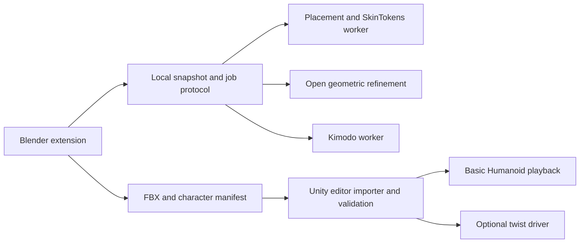

# Final plan for a local Blender character extension targeting Unity

Decision date: 3 October 2026. Primary target: Unity 6.3 LTS, using the installed `6000.3.21f1` editor for acceptance. Authoring host: the connected Blender `5.2.0 LTS`. Hardware: NVIDIA GPU with 16–24 GB VRAM.

Implementation checkpoint: foundation 0.3.0 adds actual local SkinTokens fixed-rig weight proposals, validated copy-only application and Windows/Vulkan inference. Character/selected-Action export and Unity checks pass; the export weight floor now mirrors the tested Unity importer. Regional refinement, joint placement and generated motion remain pending. The user authorized continuing through the remaining implementation steps without waiting between milestones. See [the current build handoff](./build-handoff.md). Planning observations below retain their original inspection dates.

Build an independent Blender extension that replaces ARP and Voxel Heat Diffusion for the user's game-character workflow. Use a fixed Mixamo-style humanoid skeleton based on the inspected scene armature, local AI joint/weight proposals, regional geometric correction, optional twist joints, local Kimodo motion, and a tested FBX path to Unity. Include a small open-source Unity companion for deterministic import setup and optional twist evaluation.

This is the implementation plan, not an implemented extension or a demonstrated inference benchmark. Preparation now includes a local avatar inventory, GLB metadata audit and six isolated Blender imports/opens. Source avatars and the active scene, armature, pose and selection were not changed. Read [the compact build handoff](./build-handoff.md) before implementation.

## Decisions

| Area | Chosen approach |
| --- | --- |
| Humanoid skeleton | Preserve the inspected rig's 52 core body/finger bones and naming. Add one unweighted `Root` above `Hips`: 53 bones in the default export. |
| Optional bones | Eyes, jaw, attachment sockets and twist joints are explicit modules. Terminal reference bones are excluded from newly generated default exports. |
| Twist default | Off. First supported twist module adds one deform helper per forearm, driven consistently in Blender and Unity. |
| Placement | Fit a fixed semantic template. Evaluate original MIA as the first local humanoid landmark provider; geometry refines positions and frames. Manual corrections remain available. |
| Primary weights | SkinTokens conditioned on the accepted core skeleton. Official implementation is the reference; compare its native port for Windows packaging. |
| Difficult geometry | Exact rigid attachment, constrained intrinsic surface refinement, and open local voxel/geodesic refinement. |
| Animation | Kimodo humanoid motion plus an explicit SOMA-to-target mapping, contact review, root-motion handling and clip finishing. |
| Unity export | FBX character and separate FBX clips, plus a JSON manifest. Unity Humanoid is the default. Generic is available for exact baked animation and mechanical rigs. |
| Runtime dependency | Basic Humanoid playback requires no custom runtime. Optional twists require the supplied Unity driver when using arbitrary Humanoid animations. |
| Product scope | First release covers T/A-pose humanoids, hands, layered clothing and rigid accessories. Creature generation, free cloth and advanced facial animation follow later. |

## 1. What the live Blender scene contains

The connector found one object, `Armature`, with 67 bones and no mesh objects in the scene. All 67 bones currently have `use_deform = true`. There are no pose constraints, no nonidentity pose-bone basis transforms and no Actions. The object has unit scale and an essentially identity world transform. Scene units are meters. The `.blend` file has no saved path.

The hierarchy uses `Hips`, `Spine`, `Spine1`, `Spine2`, `Neck`, `Head`, `LeftShoulder`, `LeftArm`, `LeftForeArm`, `LeftHand` and mirrored right-side names. It has five fingers on each hand, named `Thumb`, `Index`, `Middle`, `Ring`, and `Pinky`, with bones numbered 1–4. Legs use `UpLeg`, `Leg`, `Foot`, `ToeBase`, and `Toe_End`.

The arm bones descend about 59.37 degrees below horizontal. Because the pose-bone basis transforms are identity, the lowered-arm configuration is in the stored rest geometry. It is not a T-pose temporarily hidden by a pose animation.

The 67 bones divide into:

| Group | Count | Treatment in the new default profile |
| --- | --- | --- |
| Body and limb core | 22 | Retain |
| Three articulated joints per finger | 30 | Retain |
| Eyes | 2 | Optional module |
| Finger terminal bones numbered 4 | 10 | Keep as detection/reference endpoints; no default export |
| Head and toe endpoints | 3 | Keep as detection/reference endpoints; no default export |

The read-only [scene snapshot](./reference/blender-humanoid-armature-2026-10-03.json) preserves names, parents, heads, tails and rest matrices. This is a design reference; the scene's absent mesh means we cannot verify its weights or deformation. No conclusion that its terminal bones are unweighted was inferred. Existing imported rigs with weighted terminals must preserve them or perform an explicitly validated remap.

## 2. Skeleton specification

### Core hierarchy and mapping

Keep the familiar names without a mandatory `mixamorig:` prefix. Import adapters accept prefixed or unprefixed names and map them to stable semantic IDs. Do not depend on a model's bone index order or Unity's name guessing.

```text
Root
└─ Hips
   ├─ Spine
   │  └─ Spine1
   │     └─ Spine2
   │        ├─ Neck → Head
   │        ├─ LeftShoulder → LeftArm → LeftForeArm → LeftHand
   │        │  └─ five fingers, each with joints 1 → 2 → 3
   │        └─ RightShoulder → RightArm → RightForeArm → RightHand
   │           └─ five fingers, each with joints 1 → 2 → 3
   ├─ LeftUpLeg → LeftLeg → LeftFoot → LeftToeBase
   └─ RightUpLeg → RightLeg → RightFoot → RightToeBase
```

| Our name | Unity humanoid identity |
| --- | --- |
| `Hips` | Hips |
| `Spine`, `Spine1`, `Spine2` | Spine, Chest, UpperChest |
| `Neck`, `Head` | Neck, Head |
| `LeftShoulder`, `RightShoulder` | LeftShoulder, RightShoulder |
| `LeftArm`, `RightArm` | LeftUpperArm, RightUpperArm |
| `LeftForeArm`, `RightForeArm` | LeftLowerArm, RightLowerArm |
| `LeftHand`, `RightHand` | LeftHand, RightHand |
| Finger `1`, `2`, `3` | Corresponding Proximal, Intermediate, Distal finger identities |
| `LeftUpLeg`, `RightUpLeg` | LeftUpperLeg, RightUpperLeg |
| `LeftLeg`, `RightLeg` | LeftLowerLeg, RightLowerLeg |
| `LeftFoot`, `RightFoot` | LeftFoot, RightFoot |
| `LeftToeBase`, `RightToeBase` | LeftToes, RightToes |
| `Root` | Structural/motion root; not mapped to Hips or another humanoid slot |

The body-plus-fingers base is 52 deform bones. `Root` is unweighted and must be retained explicitly in the FBX hierarchy. It provides a stable place for character translation/yaw and a useful Generic root node. Unity Humanoid has its own body/root-motion projection, so adding this bone does not by itself define Humanoid root-motion behavior.

`Pinky` in our bone names maps to Unity's `Little` finger identities. The importer resolves the API's actual human labels from the supported Unity human-bone definitions rather than constructing them by string replacement. This prevents a familiar bone name from becoming an invalid Avatar mapping.

Fit proportions to the character. Preserve the reference's semantic hierarchy while deriving appropriate joint frames, thumb orientation and bend planes for each asset. The reference's bone axes and lengths are initial evidence, not universal human proportions. Preserve intentional offsets; forcing every child head to its parent's tail would change the inspected reference.

### Rest pose and Unity calibration

Support T-pose and A-pose authoring. Binding must use the actual accepted mesh and rest skeleton. Keep a separately recorded T-pose calibration for the Unity Avatar; do not silently convert an already bound A-pose into a different bind pose.

The Unity import companion applies the explicit human mapping and calibration through the supported importer/Avatar APIs, then checks the resulting Avatar. Calibrating an A-pose asset and keeping its original bind matrices is an early proof-of-concept gate. If calibration fails, require a focused pose correction before declaring the asset ready. A reference T-pose animation is useful for inspection, but does not by itself configure a valid Avatar. [Unity Avatar setup](https://docs.unity3d.com/6000.3/Documentation/Manual/ConfiguringtheAvatar.html), [importer API](https://docs.unity3d.com/6000.3/Documentation/ScriptReference/ModelImporter-humanDescription.html).

### Optional modules

Eyes add two bones parented to `Head`; jaw adds one. Use only when the asset needs them. Finger terminal and head/toe endpoint positions remain available to detection and visualization without consuming export bones by default. Sockets can be ordinary attachment transforms or optional bones according to the export profile.

Keep core parents and semantic IDs unchanged when modules are enabled. Include the enabled-module set and hierarchy version in the export manifest. Newly generated eyes need appropriate gaze frames; the scene's eye bone tails alone are not a reliable universal gaze-axis definition.

## 3. Twist joints and the Unity driver

Add `LeftForeArmTwist` and `RightForeArmTwist` as optional leaf branches under their corresponding forearm bones. The core chain remains `ForeArm → Hand`; the helper is not inserted between them. The first twist preset therefore has 55 bones including `Root`, or 57 with eyes. Upper-arm and leg twist modules can be added after the forearm implementation passes validation.

Place helpers along their accepted forearm segment, using a default midpoint and an editable axial-twist fraction. Initialize orientation from the segment's rest frame. Compute twist using quaternion swing/twist decomposition and rest-frame offsets. Resolve the helper's desired transform relative to its actual parent, accounting for inherited rotation; avoid adding a fraction on top of an already inherited full twist. Handle angle wrapping and near-180-degree cases explicitly.

Run AI skinning on the 52-bone core first. Add helpers afterward and redistribute the relevant soft forearm support using anatomical surface position and a constrained refinement. Keep all other influences and locks consistent. Never redistribute a rigid attachment merely because it lies near a twist helper. This avoids making optional helper hierarchies an untested requirement for the neural model.

Unity's `lowerArmTwist` setting distributes roll between existing elbow/wrist joints; it is not a complete specification for our added helper. Unity's documented Twist Correction uses explicit driven nodes. These are distinct mechanisms. [Humanoid twist parameter](https://docs.unity3d.com/6000.0/Documentation/ScriptReference/HumanDescription-lowerArmTwist.html), [Twist Correction](https://docs.unity3d.com/Packages/com.unity.animation.rigging@1.3/manual/constraints/TwistCorrection.html).

Ship a small optional Unity runtime component with the twist profile. It evaluates the same mathematical driver after the chosen Animator/IK evaluation path. Use an animation job/playable implementation with a tested ordering contract; a debug implementation can support comparison against Blender. Avoid requiring a large custom animator rig or a mandatory third-party rigging package. [Unity animation-job API](https://docs.unity3d.com/6000.0/Documentation/ScriptReference/Animations.IAnimationJob.html).

Imported baked helper curves do not establish correctness under arbitrary Humanoid retargeting. The supported policies are:

- **Basic Humanoid:** no helper-dependent weighting and no custom runtime requirement.
- **Humanoid with twists:** companion driver recomputes helper transforms from the final humanoid pose; baked helper curves are not authoritative.
- **Exact Generic playback:** helper transforms can be baked into character-specific clips; preserve the matching skeleton.

Validate Unity's Avatar twist settings and our helper driver together to prevent double correction. Store those settings per preset. Keep Optimize Game Objects disabled in the first validated twist profile; optimized hierarchies require explicit bindings/exposed transforms and a separate acceptance pass. The exporter must not offer a helper-dependent Humanoid rig as ready without identifying its runtime dependency.

## 4. Independent placement and skinning

### Placement

Use original MIA as the first candidate for semantic humanoid joint proposals, subject to its checkpoint/backbone license and hardware audit. Fit the accepted fixed template rather than use a free-form generated human hierarchy. Apply geometric refinement to joint depth, bend direction, symmetry and thumb/finger chains. Lock user corrections.

The release gate is measured correction effort on actual humanoids. If the candidate does not pass, retain fast marker/template fitting as the independent fallback and improve the placement provider. Do not make ARP a fallback dependency or describe marker fitting as proven automatic placement. MIA v2's Hunyuan dependency is excluded from the default while its territorial terms conflict with this workflow. [MIA](https://github.com/jasongzy/Make-It-Animatable), [backbone terms](https://huggingface.co/tencent/Hunyuan3D-2.1/blob/main/LICENSE).

### Primary AI weights

Use SkinTokens skin-only inference on the accepted core skeleton. Treat its output as weights to transfer/remap onto the original meshes; keep the accepted joint transforms authoritative. Compare official PyTorch inference with `skin-tokens.cpp` before choosing the shipped worker. Select the native worker if it passes Windows, memory, correspondence and deformation gates; otherwise ship the isolated reference environment first. QtMeshEditor's ONNX adapter is a later packaging alternative, not another mandatory backend. [Reference](https://github.com/VAST-AI-Research/SkinTokens), [native port](https://github.com/localai-org/skin-tokens.cpp).

### Regional correction

| Region | Default policy |
| --- | --- |
| Organic body | AI proposal with plausible anatomical support and constrained correction |
| Fingers | Digit identity and permitted chain influences; surface refinement with a palm transition |
| Rings, rigid plates and buckles | Explicit inferred/accepted one-bone attachment |
| Tight clothing | AI or correspondence-filtered transfer from an accepted body |
| Thin surfaces | Intrinsic surface solve with reliable attachment/boundary seeds |
| Unreliable surface or suitable closed volume | Open voxel/geodesic candidate with local gap and occupancy checks |

Provide two distinct open geometric options: intrinsic surface harmonic refinement and volume/geodesic refinement. The public MIT surface-heat implementation can be a comparison/alternative; its voxel-assisted seeding means it is not equivalent to a grid-free surface solver. Implement selected-region volume heat diffusion as an additional mode when it provides measured value. Do not promise every volume method is the same algorithm.

The selector begins as explicit movement rules and diagnostics. It operates on regions/components and vertex–bone support, then solves adjoining soft transitions consistently. AI remains the primary organic proposal; exact rigid attachments override inappropriate soft predictions. Protect user locks, enforce nonnegative normalized rows, limit exported influences to four, and repeat deformation checks after pruning. Detailed mechanisms and edge cases are in [the adaptive design](./adaptive-local-skinning-design.md).

Imported render geometry needs a transient refinement graph distinct from its stored topology. UV/material/normal splits can turn a continuous hand into hundreds of disconnected edge components. Reconcile verified seam duplicates and synchronize their weights without changing exported vertex attributes. Prefer original vertex provenance when available; otherwise use conservative position, normal, region and boundary evidence. Coincident vertices alone do not establish a seam: separate fingers, overlapping garments and contacting rigid parts must remain separate. Ambiguous seam connections require a diagnostic or focused correction. Preserve an untouched original-geometry view for output and a separate inference/surface representation with explicit correspondence.

## 5. Unity export contract

The primary supported format is FBX produced through Blender's open-source exporter. Internal inference exchange can use GLB or validated numerical arrays; it need not dictate the Unity deliverable. Do not depend on proprietary FBX SDK command-line workers. Keep the Unity import path independent of `.blend` auto-conversion.

An export bundle contains:

```text
Character.fbx                 mesh, armature and actual bind pose
Animations/Walk.fbx            selected baked clip on matching hierarchy
Animations/Idle.fbx            another selected clip
Character.character.json      mapping, versions, calibration and clip settings
Textures/                     referenced textures according to export settings
```

Use a versioned manifest with semantic mapping, actual ordered joints/paths, rest and calibration transforms, modules, twist definitions, root-motion policy, units/axes, material/texture references, model provenance and clip ranges. Include hierarchy and rest-pose identity checks. A separate animation asset may reuse the model Avatar only when its required skeleton/calibration is compatible; matching names alone is insufficient.

Exporter choices: selection-scoped output; deterministic hierarchy; no exporter-generated leaf bones; retain the explicit unweighted root; bake only chosen Actions; no silent export of every Action/NLA strip; preserve original mesh attributes and supported shape keys. Apply coordinate conversion exactly once. Unity-facing output uses meters and verified forward/up conversion, with import checks that a representative 1 m distance remains 1 m. Do not mix several competing scale fixes.

Asset preflight distinguishes character meshes from importer-generated bone-display objects, unrelated scene objects and alternative LODs. Export the selected character and its explicitly associated LODs, rather than every object sharing an armature. Resolve source object scale in a working representation and retain world-space geometry, bind and morph correspondence. Preserve user-selected expression shapes and test blendshape deltas through FBX. Report unsupported source drivers/modifiers, missing textures and material conversion requirements; do not bake an arbitrary evaluated scene with hidden mask drivers as if it were a clean base mesh. The first Unity proof uses a simple material preset and documents texture/color-space conversion; automatic reproduction of arbitrary Blender shaders is outside its acceptance claim.

The Unity companion's editor portion reads the manifest only for explicitly opted-in bundles. It sets the Humanoid mapping, four-influence import policy, intended clip ranges and root settings, then creates a validation report and optionally a prefab. It must preserve user overrides on reimport and avoid recursively reimporting the same asset. It must not globally change unrelated FBX files.

Default to Humanoid for ordinary humans. Provide Generic for mechanism-specific robots and exact baked creature/character clips. A humanoid-shaped robot can use Humanoid when its joint degrees of freedom fit; precise hinge restrictions and additional mechanisms require an explicit tested profile. [Unity rig import reference](https://docs.unity3d.com/6000.0/Documentation/Manual/FBXImporter-Rig.html).

## 6. Motion and game clip finishing

Use Kimodo SOMA-RP as the primary local human motion provider, with its pinned open-weight terms and explicit conversion to the fixed target. Semantic correspondence, rest frames and limb proportions are required. Never replace the accepted target skeleton with the motion model's skeleton.

The motion step includes duration/seed, root-motion or in-place output, trimming, loop review, contact checks and a new Blender Action. Human foot contacts should be checked after retargeting. Arms and hands must be checked around props; the current SOMA/native motion path does not imply detailed finger animation. Provide editable hand pose presets for grips and gestures so articulated fingers are useful even when the motion provider supplies no suitable finger curves.

For root-motion clips, separate character travel from pelvic motion without duplicating displacement. Keep distinct policies for locomotion, jumps and stationary gestures. Export the intended settings in the manifest and verify Unity's Humanoid body/root projection. For in-place clips, remove only intended travel; preserve pelvic movement and required vertical action. [Unity root motion](https://docs.unity3d.com/6000.0/Documentation/Manual/RootMotion.html).

Kimodo is constrained to its learned motion families and can produce foot skating or imperfect constraint matching. A generated sequence is not automatically a clean loop or an interaction clip. Contact and loop postprocessing is part of the product. Queue motion inference after skinning to avoid assuming both models fit in VRAM together. [Kimodo best practices](https://research.nvidia.com/labs/sil/projects/kimodo/docs/key_concepts/limitations.html).

## 7. User experience and architecture

The main workflow is **select character → Build Character → Generate or choose motion → Export to Unity**. The default preset includes the core hands and four-weight profile; optional twists are off. Advanced controls live behind focused region/joint review, not a mandatory global solver menu.

When the system needs correction, focus on the affected item: shoulder depth, ambiguous ring attachment, touching fingers or a rigid knee cover. Provide move/lock joint, mark soft/rigid, attachment picker, bone exclusions, protected weights, regional refinement, before/after comparison and undo. Retain an imported accepted armature without forcing it to be rebuilt. Store corrections in the project and preserve them across jobs.

Separate responsibilities:



Keep inference outside Blender's embedded Python. Use private job directories, pinned model/runtime versions, hashes, cancellation and scene revision checks. Validate output before one undoable application. No cloud account or service is required. Record peak VRAM and host RAM with Blender running; a 16 GB GPU being above an upstream minimum is not a guarantee of usable headroom.

Develop the extension in a separate repository when implementation begins; keep the present Mesh2Motion application unchanged. Share a provider protocol where useful, with browser integration deferred. Own new Blender client code under GPL-compatible terms, and independently developed worker/Unity companion code under permissive terms, subject to the dependencies actually included. Complete the dependency inventory before distribution. Build the parametric template ourselves from the accepted semantic design; the inspected scene is a reference and does not establish redistribution rights to any third-party template asset. Puppeteer/PartField and the installed proprietary VHD executable are excluded from the shipped stack.

## 8. Implementation milestones

| Milestone | Concrete deliverable | Exit condition |
| --- | --- | --- |
| 0. Fixtures and reproducible baseline | Corpus manifest, source hashes, explicit mesh/LOD selection, clean derived fixtures and family split | Read-only originals verified; imported-rig, blind-placement and fixed-rig-skinning modes cannot leak reference data; synthetic ring/finger/hinge fixtures specified |
| 1. Skeleton and Unity proof | Reference-derived 52-bone core, root, mapping, A/T calibration, deterministic FBX and minimal import companion | Valid Humanoid Avatar; scale/rest axes verified; reference animation works on two different proportions; no scene-reference mutation |
| 2. Placement and inference evaluation | Original-MIA placement trial, marker fallback, official/native SkinTokens comparison on the same accepted rigs | Measured placement/correction effort, valid original-vertex weights, consumer memory/latency and a selected shippable backend |
| 3. Adaptive binding | Rigid attachment, digit restrictions, surface solve, region locks and diagnostics | Rings stay rigid; unrelated finger movement does not pull another digit; corrections survive rebuild |
| 4. Optional twist support | Two forearm helpers, weight augmentation, matching Blender/Unity driver | Valid under imported clips and different Humanoid clips; no doubled correction; Generic baked comparison passes |
| 5. Motion to Unity | Kimodo retargeting, hand presets, loop/contact/root policies, selected-clip export | Walk, idle, turn, jump and a grip/interaction example survive Unity playback and transitions |
| 6. Volume and production hardening | Local voxel/geodesic/heat alternatives, layered/modular assets, error recovery, packaging and licensing | Difficult-geometry benchmark passes; jobs cancel/undo/reject stale output; offline fresh-install workflow tested |
| 7. Later expansion | Creature/Generic profiles, secondary motion and optional advanced facial features | Independent capability benchmarks; no promise of Kimodo creature motion |

Placement and neural inference experiments in milestone 2 must precede a large UI investment. They may demonstrate that the near-one-click target needs a better placement provider or fine-tuning; neither possibility is assumed solved by this plan. Core placement, binding and animation are evaluated separately to isolate failures.

## 9. Local avatar corpus and evaluation protocol

The user authorized local imports from these three directories. The inventory found 623 candidate model files, counting revisions and formats separately; this is not 623 independent characters.

| Source directory | Blender | GLB | FBX | glTF | Total |
| --- | ---: | ---: | ---: | ---: | ---: |
| `R:\BLENDER\ReadyPlayerMe` | 312 | 137 | 19 | 6 | 474 |
| `R:\BLENDER\BANTER_Avatars` | 41 | 73 | 1 | 0 | 115 |
| `R:\BLENDER\Altspace_Avatars` | 34 | 0 | 0 | 0 | 34 |

The versioned [corpus manifest](./reference/avatar-test-corpus.json) records 14 initial candidates, file sizes, SHA-256 hashes, family IDs and GLB metadata. The [isolated Blender audit](./reference/avatar-blender-audit-2026-10-03.json) records six actual imports/opens in Blender 5.2 with auto-execution disabled. These are import and structural checks, not deformation or AI quality results. No source files were saved. The connected unsaved reference scene was not used for the audit.

### Initial cases

| Candidate | Observed structure and intended role |
| --- | --- |
| `ReadyPlayerMe\Camera_male_01.glb` | 65 skin joints, two weighted primitives; ordinary baseline candidate pending visual review |
| `ReadyPlayerMe\Hazmat_female_01.glb` and `Hazmat_male_01.glb` | 65 joints each; paired proportions/outfit candidates in one family, not independent holdouts |
| `BANTER_Avatars\Shane.glb` | Imported 67-bone unprefixed `Hips` rig, two character meshes, three head morph targets; first imported-rig compatibility fixture |
| `BANTER_Avatars\Bloom\Bloom2.glb` and `.fbx` | GLB has 65 skin joints; FBX imports 78 prefixed bones and six meshes including named LODs. Do not assume the formats are identical fixtures |
| `BANTER_Avatars\CardboardBoy\CardboardBoy_02.glb` | Imported 65 prefixed bones, five character meshes; 18 head morph targets. Hands have 4,303 vertices and 512 edge components: seam/partition stress case |
| `BANTER_Avatars\CardboardGirl\CardboardGirl_03.glb` | 65 joints, five weighted primitives, up to 17 morph targets and one animation; same broad family as CardboardBoy for split purposes |
| `BANTER_Avatars\FN T-800_5.glb` | Imported 67 bones with two weighted character meshes; robot appearance candidate. File name and rig do not establish rigid mechanical segmentation |
| `BANTER_Avatars\RoboDuck\roboduck.glb` | 65 joints, two weighted primitives, up to three morph targets; stylized candidate pending visual review |
| `BANTER_Avatars\Dummy_08_ShapeKeyed.glb` | 67 joints, four weighted primitives, a morph target; expression and attribute-preservation candidate |
| `ReadyPlayerMe\FloatingHead.glb` | Two weighted primitives and 65 joints despite its partial-character name; partial-input triage candidate, not a full-humanoid acceptance substitute |
| `Altspace_Avatars\Humanoid\human_base_meshes_bundle.blend` | Opened successfully: 44 mesh objects, no armatures, 20 meshes with nonunit scale. Includes male/female stylized bodies. Select individual assets; do not bind the whole collection as one character |
| `Altspace_Avatars\Guest\Guest_29.blend` | Opened successfully: 59-bone rig, 60 mesh objects, four Actions, 20 meshes with nonunit scale; modular selection and existing-animation compatibility candidate |

Paths in the table are relative to `R:\BLENDER`; the manifest contains absolute paths. Primitive POSITION counts in the manifest are storage counts, not necessarily unique geometric vertices. Edge components are measured on imported mesh edges and can reflect seam splits, disconnected surfaces or both. Blender's GLB importer also produced an `Icosphere` display object in the audited GLBs; this is excluded from character fixtures. The base-mesh bundle emitted invalid mask-driver warnings, so fixture extraction needs an explicit modifier policy before geometry quality can be judged.

### Three independent test modes

1. **Imported-rig preservation:** keep the asset's existing accepted rig and weights. Test adapters, prefix handling, optional terminals, scale, morphs, LOD selection, selected Actions and FBX/Unity playback. Do not silently collapse a 59/65/67/78-bone source into the new 53-bone default.
2. **Blind placement:** make a derived mesh-only fixture. Remove armatures, weights, joint metadata and landmark-bearing object names from the provider input; retain a private reference outside that input. Fit the fixed core, review joint centers/bend planes and record correction time. Truly unrigged Altspace bodies add coverage without an imported skeleton reference. An existing rig is a comparison, not unquestionable ground truth.
3. **Fixed-rig skinning:** freeze the same accepted joints for every provider, remove source weights from its input, and compare official/native AI, surface and volume candidates under identical poses. Evaluate deformation, rigid preservation and correction effort rather than demand identical weights, since multiple weight solutions can produce acceptable motion.

Freeze development/validation/holdout assignments after visual triage and before tuning. Split by underlying character family across all three roots; LODs, revisions, re-exports and shared base meshes stay together. SHA-256 catches identical files, while geometry/provenance comparison and manual review catch nonidentical copies. The initial metadata manifest intentionally leaves split assignments unset; labels inferred from names alone are not sufficient. Freeze a representative subset for routine checks and reserve whole families for final acceptance.

Create clean derived fixtures in a dedicated build/test workspace, never beside or over the originals. Keep source hashes and selection/modifier records; verify hashes after extraction. Do not include private avatar binaries in the extension repository or release, and do not infer training/redistribution rights from permission to test locally. Record missing linked libraries/textures and available material, shape-key and LOD correspondence.

The real corpus does not yet establish a verified ring or precise mechanical hinge case. Add small controlled fixtures: a finger with an unattached ring, near-contact and touching digits, a glove seam, layered clothing, a rigid plate over a soft elbow, a two-part hinge and a nonuniform-scale character. Include detached and welded accessories, deliberately ambiguous seams, and a missing/partial limb. Require focused intervention or an unsupported-input result when evidence is insufficient; do not report successful automatic binding solely because a normalized weight matrix was produced.

Record per-case placement error where reliable reference labels exist, correction count/time, leakage under isolated finger motions, rigid-part distortion, seam continuity, penetration/contact failures, blendshape preservation and Unity import results. Record peak VRAM/RAM and cold/warm end-to-end latency separately. Numeric thresholds should be pinned with units and asset scale during baseline establishment, before backend selection, rather than invented as already demonstrated guarantees.

## 10. Acceptance criteria

Test the full path on licensed real assets plus synthetic diagnostic geometry. Cover ordinary and stylized humans, close fingers, rings, clothing layers, hard accessories, asymmetry, UV seams, mixed rigid/soft robots and differing proportions. Use a held-out set for final evaluation.

- Unity reports a valid human Avatar for the default humanoid profile, with correct finger mappings and no unresolved calibration failure.
- Unity imported scale, orientation, bind pose and joint identities agree with the export manifest.
- Original topology/material references are preserved; weights are finite, nonnegative, normalized and limited to the selected four-influence profile.
- Accepted user locks and rigid attachments remain exact. Rigid-part lengths are unchanged within floating-point tolerance under rigid transforms.
- Pose tests cover individual fingers, elbow/knee bends, shoulders, forearm rolls, squat and mixed motion. No helper-dependent deformation is accepted without its driver.
- Compare Blender FBX-intended LBS against Unity Generic playback for numerical deformation fidelity. Evaluate Unity Humanoid separately because retargeting intentionally modifies poses; judge contact, proportions and visual quality rather than require identical vertices.
- Basic and twist-enabled profiles both accept external Humanoid animation. Test transitions, Animator/IK ordering, clip masks and relevant optimization settings.
- Animation-only assets with matching hierarchy reuse the intended Avatar; changed module/rest versions are detected and handled explicitly.
- Root-motion and in-place policies behave as labeled in Unity; loops and contacts are checked after retargeting.
- Model quality is judged by failure rate and correction time as well as deformation metrics. Hardware timings include preparation, model loading, refinement and export.
- Undo, cancellation, reopening, reimport and stale-result rejection preserve user decisions and prevent partial scene changes.
- Installation and inference work locally with verified/pinned artifacts and no proprietary add-on runtime.

The primary validation editor is the installed Unity `6000.3.21f1`. Add `2022.3.62f1` compatibility checks after the primary path is stable. Finding installed editors did not launch or modify a Unity project. The corpus audit imported/opened six existing avatars in an isolated background Blender process; no Unity import, new FBX export, AI run or twist-driver execution was performed during this planning task.

## Supporting evidence

The inspected scene snapshot supplies the concrete hierarchy and rest-pose facts. The earlier [project research](./local-ai-rigging-and-skinning-research.md) and [adaptive skinning design](./adaptive-local-skinning-design.md) supply model/dependency findings and geometric mechanisms. Unity references above establish importer, Avatar, root-motion and twist APIs. Architecture, default profiles, module counts, milestones and validation gates are design decisions made for this project.
